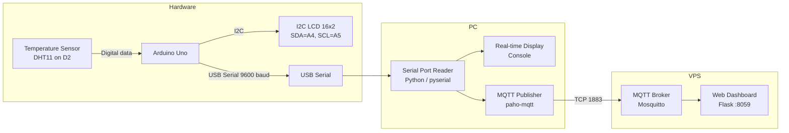

# Temperature Display and MQTT Monitoring

Embedded exam project: read temperature on Arduino Uno, display on I2C LCD, send via serial to a PC client, and publish to an MQTT broker.

**System flow:** Temperature Sensor → Arduino Uno → LCD + USB Serial → PC Program → MQTT Broker

---

## (a) System Architecture Diagram



### Wiring

| Component | Pin | Arduino Uno |
|-----------|-----|-------------|
| Temperature sensor | GND (-) | GND |
| | VCC (Middle) | 5V |
| | Signal (S) | D2 |
| I2C LCD 16×2 | GND | GND |
| | VCC | 5V |
| | SDA | A4 |
| | SCL | A5 |

---

## Project Structure

```
embedded-exam/
├── arduino/
│   └── temperature_display/
│       └── temperature_display.ino
├── pc/
│   ├── mqtt_client.py
│   ├── mqtt_listen.py
│   └── config.example.env
├── dashboard/
│   ├── app.py
│   ├── requirements.txt
│   └── templates/
│       └── index.html
├── requirements.txt
└── README.md
```

---

## (b) Arduino Program

See `arduino/temperature_display/temperature_display.ino`.

**Libraries (Arduino IDE → Library Manager):**
- DHT sensor library (Adafruit)
- Adafruit Unified Sensor (installed automatically with DHT library)
- LiquidCrystal_I2C (Frank de Brabander)

**Before upload:** set `CANDIDATE_NAME` to your full name in the sketch.

---

## (c) Horizontal Scrolling

If the candidate name exceeds 16 characters, row 1 scrolls horizontally one character every 300 ms.

---

## (d) PC-Side Client

```powershell
pip install -r requirements.txt
py pc\mqtt_client.py
```

Close Arduino Serial Monitor before running. Edit `SERIAL_PORT` in `pc/mqtt_client.py` if your port is not COM3.

---

## (e) Communication Names

### Arduino ↔ PC (Serial)

| Setting | Value |
|---------|-------|
| Protocol | USB Serial (UART) |
| Baud rate | **9600** |
| Port | **COM3** (change if needed) |
| Message format | One temperature per line, e.g. `24.0` |

### PC ↔ MQTT Broker

| Setting | Value |
|---------|-------|
| Broker | **`broker.benax.rw`** |
| Port | **1883** |
| Topic | **`sensor_rutaganira_yanis_ntwali`** |
| Payload | Temperature string, e.g. `"24.0"` |

Verify MQTT (optional — pick one):

**Option A — PC console only (enough for the exam):**  
`mqtt_client.py` already prints `Temperature: 24.0` in real time while publishing.

**Option B — Python listener on PC (easier than SSH):**

```powershell
py pc\mqtt_listen.py
```

Then in a second window run `py pc\mqtt_client.py`.

**Option C — SSH on VPS:**

```bash
mosquitto_sub -h 127.0.0.1 -t "sensor_rutaganira_yanis_ntwali" -v
```

Keep this running, then start `mqtt_client.py` on your PC. It shows nothing until messages arrive — that is normal.

---

## Dashboard (submit this link)

See **`deploy/DEPLOY.md`** for full VPS deployment steps.

**Dashboard link after deploy:** http://157.173.101.159:8059

### Quick deploy from Windows

```powershell
powershell -ExecutionPolicy Bypass -File deploy\upload-and-deploy.ps1
```

Enter your VPS password when prompted, then run `py pc\mqtt_client.py` on your PC.
